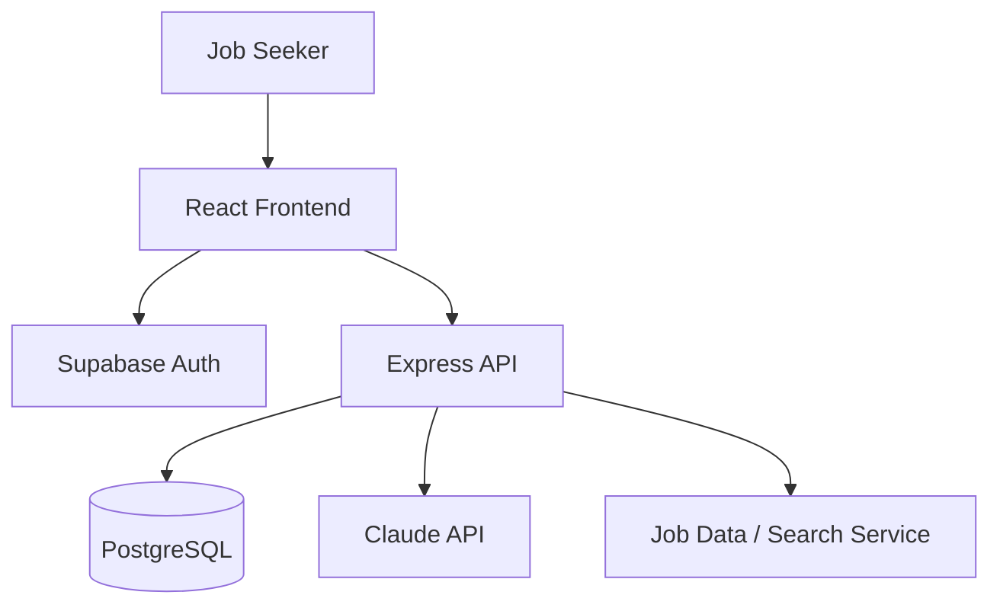
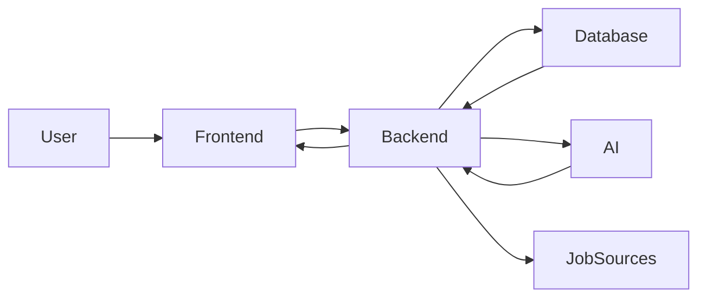

# Day 52 — System Architecture

## Project
Jobs & Career Assistant

## 1. Overview
The product helps job seekers discover suitable opportunities, organize applications, improve application materials, and receive AI-assisted career guidance.

## 2. Tech Stack
- Frontend: React + Vite
- Backend: Node.js + Express
- Database: PostgreSQL
- Authentication: Supabase Auth
- AI: Claude API (server-side)
- Hosting: Vercel (frontend) + Render (backend)
- Other: REST API, Mermaid diagrams, Git/GitHub

These choices keep the v1 stack relatively low-cost, familiar, and easy to deploy.

## 3. Component Diagram

## 4. Data Flow

## 5. Request Lifecycle
1. User opens a screen.
2. Frontend checks authentication.
3. Frontend sends a REST request.
4. Backend validates the request and authenticated user.
5. Backend reads/writes PostgreSQL or calls an external service.
6. AI requests are sent server-side when required.
7. Backend normalizes the result.
8. Frontend displays the response.

## 6. AI Interaction
AI is used for job-fit explanations, resume improvement, cover-letter assistance, and career guidance. Sensitive credentials are never sent to the browser. AI outputs are treated as suggestions and are reviewable/editable by the user.

## 7. External Services
- Supabase Auth
- Claude API
- Job-search/data provider, if configured
- Vercel
- Render

## 8. Security
Authentication tokens are validated server-side. API keys remain in environment variables. Users can access only their own private records.
