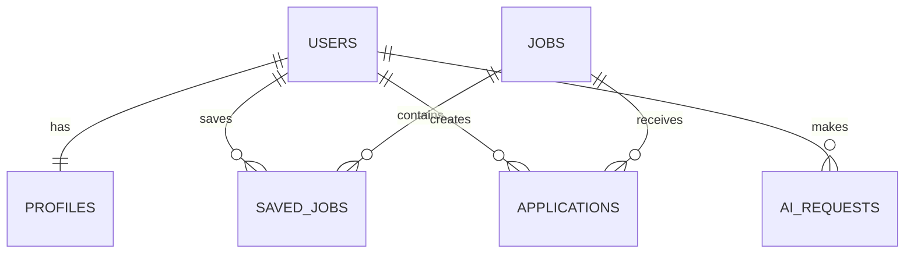

# Day 52 — Database Schema

## 1. users
| Field | Type | Constraints |
|---|---|---|
| id | UUID | PK |
| email | TEXT | UNIQUE, NOT NULL |
| name | TEXT | NOT NULL |
| created_at | TIMESTAMP | NOT NULL |

## 2. profiles
| Field | Type | Constraints |
|---|---|---|
| id | UUID | PK |
| user_id | UUID | FK users.id, UNIQUE |
| headline | TEXT | nullable |
| skills | JSONB | nullable |
| experience | JSONB | nullable |
| education | JSONB | nullable |
| updated_at | TIMESTAMP | NOT NULL |

## 3. jobs
| Field | Type | Constraints |
|---|---|---|
| id | UUID | PK |
| external_id | TEXT | nullable |
| title | TEXT | NOT NULL |
| company | TEXT | NOT NULL |
| location | TEXT | nullable |
| description | TEXT | NOT NULL |
| url | TEXT | nullable |
| created_at | TIMESTAMP | NOT NULL |

## 4. saved_jobs
| Field | Type | Constraints |
|---|---|---|
| id | UUID | PK |
| user_id | UUID | FK users.id |
| job_id | UUID | FK jobs.id |
| status | TEXT | CHECK constraint |
| notes | TEXT | nullable |
| created_at | TIMESTAMP | NOT NULL |

Unique constraint: `(user_id, job_id)`.

## 5. applications
| Field | Type | Constraints |
|---|---|---|
| id | UUID | PK |
| user_id | UUID | FK users.id |
| job_id | UUID | FK jobs.id |
| status | TEXT | NOT NULL |
| applied_at | TIMESTAMP | nullable |
| notes | TEXT | nullable |
| created_at | TIMESTAMP | NOT NULL |

## 6. ai_requests
| Field | Type | Constraints |
|---|---|---|
| id | UUID | PK |
| user_id | UUID | FK users.id |
| request_type | TEXT | NOT NULL |
| input_summary | TEXT | NOT NULL |
| output_summary | TEXT | NOT NULL |
| created_at | TIMESTAMP | NOT NULL |

## Relationships

## User-story validation
- Account access → users/profiles
- Profile management → profiles
- Job discovery → jobs
- Save opportunities → saved_jobs
- Track applications → applications
- AI career assistance → ai_requests

Indexes should be added for user_id, job_id, status, and created_at where query volume requires them.
