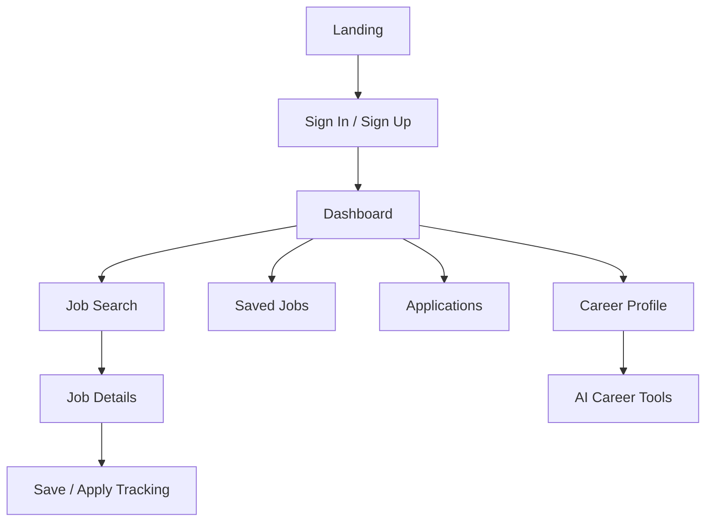

# Day 52 — UI & User Flow

## 1. User Flow


## 2. Navigation
- Dashboard
- Find Jobs
- Saved Jobs
- Applications
- Career Profile
- AI Tools
- Settings

## 3. Low-Fidelity Wireframes

### Dashboard
```text
+------------------------------------------------+
| Logo | Dashboard | Jobs | Applications | User |
+------------------------------------------------+
| Welcome back                                   |
| [Profile completion] [Applications] [Saved]    |
|                                                |
| Recommended Jobs                               |
| [Job Card] [Job Card] [Job Card]              |
+------------------------------------------------+
```

### Job Search
```text
+-----------------------------------------------+
| Search jobs [____________] [Search]           |
| Location [________] Filters [____]            |
|                                               |
| Job Card                                      |
| Title • Company • Location                   |
| [View Details] [Save]                         |
+-----------------------------------------------+
```

### Job Details
```text
+-----------------------------------------------+
| Job Title                                      |
| Company • Location                             |
|                                               |
| Description                                   |
| Requirements                                  |
|                                               |
| [Save Job] [Track Application]               |
+-----------------------------------------------+
```

### Applications
```text
+-----------------------------------------------+
| Applications                                  |
|                                               |
| Job       Company       Status       Date     |
| Role A    Company A     Applied      ...      |
| Role B    Company B     Interview    ...      |
+-----------------------------------------------+
```

### AI Tools
```text
+-----------------------------------------------+
| AI Career Tools                               |
| [Resume Review] [Cover Letter] [Job Fit]      |
|                                               |
| Input / Context                               |
| [........................................]    |
| [Generate]                                    |
|                                               |
| AI Suggestions                                |
| [Editable output area......................]  |
+-----------------------------------------------+
```

Every screen has a clear purpose and is reachable from primary navigation.
